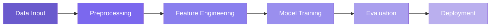

# 🌟 Hi, I'm Raj Vekariya

<div align="center">
  
[](https://git.io/typing-svg)

</div>

<div align="center">
  
```ascii
╔══════════════════════════════════════════════════════════════╗
║  💼 Design Intelligent Systems | 🚀 Build Scalable APIs     ║
║  📊 Develop Data-Driven Applications                         ║
║  🎯 Actively seeking opportunities in:                       ║
║     • Machine Learning • .NET Backend • Software Engineering ║
╚══════════════════════════════════════════════════════════════╝
```

</div>


<p align="left">
  
</p>

<br clear="right"/>

---

## 🎯 Professional Summary

<table>
<tr>
<td width="50%">

```yaml
Experience:
  - Software Developer
  - DSA Foundation: Strong
  - Focus Areas:
      • ML & Deep Learning
      • Model Training & Evaluation
      • Backend Development
```

</td>
<td width="50%">

```yaml
Expertise:
  - Advanced .NET & REST APIs
  - Database Management
  - Data Analysis & Automation
  - Scalable System Design
  - Industry-Grade Tools
```

</td>
</tr>
</table>

---

## 🤖 ML & Deep Learning Focus

<div align="center">

| **Core Competencies** | **Technical Skills** |
|:---:|:---:|
| 📈 Supervised & Unsupervised Learning | 🔧 Feature Engineering & Preprocessing |
| 🎯 Model Evaluation Metrics | 🌲 Tree-Based Models |
| 📊 Logistic Regression | 🐍 Python ML Pipelines |
| 📉 Data Visualization | 🔍 Data Analysis |

</div>

<div align="center">
  


</div>

---

## 💻 Advanced .NET & Backend Skills

<div align="center">

```diff
+ ASP.NET Core Web API          + Clean Architecture & Layered Design
+ Authentication & Validation   + Entity Framework Core
+ SQL Server / MySQL / MongoDB  + RESTful API Development
+ Scalable Backend Design       + Performance Optimization
```

</div>

<details>
<summary>🔧 <b>Architecture Approach</b></summary>

```
┌─────────────────────────────────────┐
│       Presentation Layer            │
├─────────────────────────────────────┤
│       Application Layer             │
├─────────────────────────────────────┤
│       Domain Layer                  │
├─────────────────────────────────────┤
│       Infrastructure Layer          │
└─────────────────────────────────────┘
```

</details>

---

## 🛠️ Tech Stack

<div align="center">

### Languages & Frameworks
<p>

</p>

### Frontend Technologies
<p>

</p>

### Databases & Tools
<p>

</p>

</div>

<div align="center">
  
```ascii
    ____                 __                          __  
   / __ \___  _   ______/ /___  ____  ___  _____   / /_ 
  / / / / _ \| | / / __  / __ \/ __ \/ _ \/ ___/  / __ \
 / /_/ /  __/| |/ / /_/ / /_/ / /_/ /  __/ /     / /_/ /
/_____/\___/ |___/\__,_/\____/ .___/\___/_/     /_.___/ 
                            /_/                          
```

</div>

---

## 🌐 Connect With Me

<div align="center">

[](https://www.linkedin.com/in/raj-vekariya-49147a357/)
[](https://www.instagram.com/rajvekariya__7)

</div>

<div align="center">

```javascript
const raj = {
    location: "India",
    interests: ["Machine Learning", "Backend Development", "Data Science"],
    currentFocus: "Building intelligent, scalable systems",
    funFact: "I turn coffee into code ☕️"
};
```

</div>

---

<div align="center">

## 📊 GitHub Analytics


</div>

<div align="center">
  
[](https://github.com/rajpatel-7)

</div>

---

<div align="center">


### ⚡ Building Intelligent Systems with Code & Data ⚡

</div>

<div align="center">

```
╔═══════════════════════════════════════════════════════════╗
║                                                           ║
║  "The only way to do great work is to love what you do"  ║
║                                                           ║
╚═══════════════════════════════════════════════════════════╝
```

</div>

<div align="center">
  
[](https://visitcount.itsvg.in)

</div>

---

<div align="center">
  
### 🚀 Let's build something amazing together!

[](https://github.com/piyushsuthar/github-readme-quotes)

</div>
